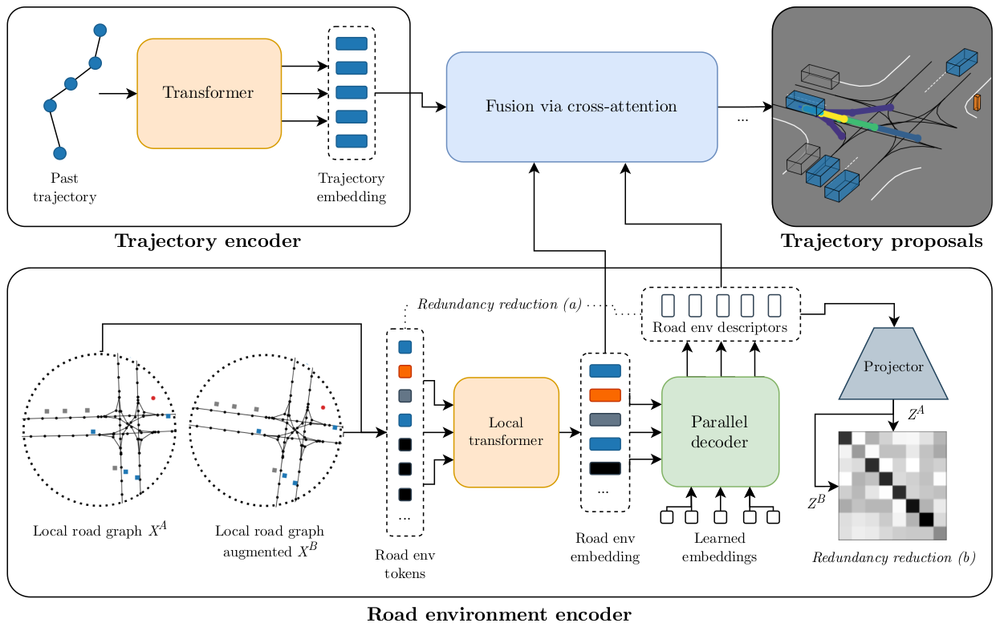
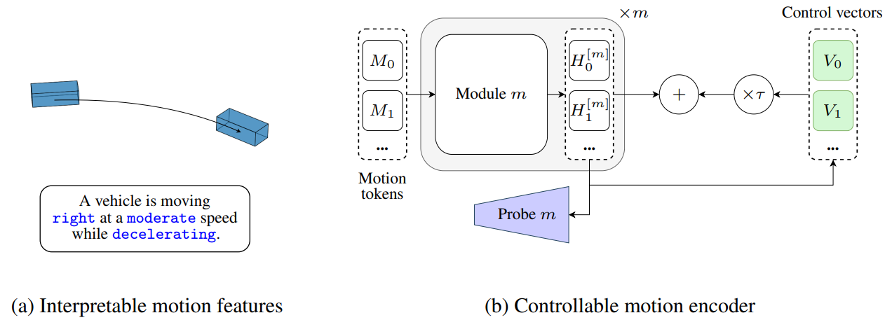
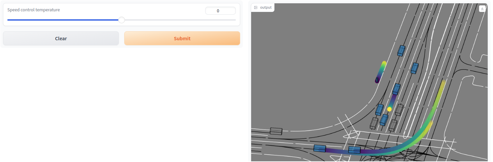
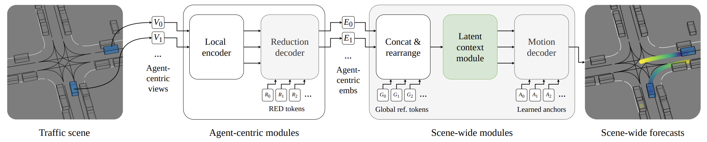
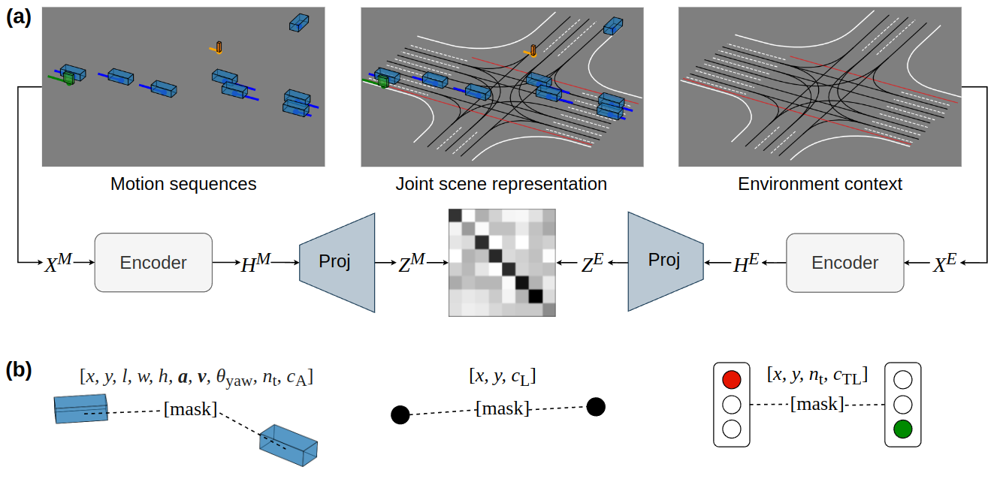

# FutureMotion
  

Common repo for our ongoing research on motion forecasting in self-driving vehicles.

## Table of contents
- [Setup](#setup)
- [Our methods](#our-methods)
  * [RedMotion](#redmotion-motion-prediction-via-redundancy-reduction)
  * [Words in Motion](#words-in-motion-extracting-interpretable-control-vectors-for-motion-transformers)
  * [SceneMotion](#scenemotion-from-agent-centric-embeddings-to-scene-wide-forecasts)
  * [JointMotion](#jointmotion-joint-self-supervision-for-joint-motion-prediction)
- [Other methods](#other-methods)
  * [Wayformer](#wayformer-motion-forecasting-via-simple--efficient-attention-networks)

## Setup
Clone this repo, afterwards init external submodules with:
```bash
git submodule update --init --recursive
```
Create a conda environment named "future-motion" with:
```bash
conda env create -f conda_env.yml
```

Prepare Waymo Open Motion and Argoverse 2 Forecasting datasets by following the instructions in `src/external_submodules/hptr/README.md`.

## Our methods

### RedMotion: Motion Prediction via Redundancy Reduction 



Our RedMotion model consists of two encoders. The trajectory encoder generates an embedding for the past trajectory of the current agent. The road environment encoder generates sets of local and global road environment embeddings as context. We use two redundancy reduction mechanisms, (a) architecture-induced and (b) self-supervised, to learn rich representations of road environments. All embeddings are fused via cross-attention to yield trajectory proposals per agent.

<details>
<summary><big><b>More details</b></big></summary>

This repo contains the refactored implementation of RedMotion, the original implementation is available [here](https://github.com/kit-mrt/red-motion).

The Waymo Motion Prediction Challenge doesn't allow sharing the weights used in the challenge. However, we provide a [Colab notebook](https://colab.research.google.com/drive/16pwsmOTYdPpbNWf2nm1olXcx1ZmsXHB8) for a model with a shorter prediction horizon (5s vs. 8s) as a demo.

<big><b>Training</b></big>

To train a RedMotion model (tra-dec config) from scratch, adapt the global variables in train.sh according to your setup (Weights & Biases, local paths, batch size and visible GPUs).
The default batch size is set for A6000 GPUs with 48GB VRAM.
Then start the training run with:
```bash
bash train.sh ac_red_motion
```
For reference, this [wandb plot](https://wandb.ai/kit-mrt/red-motion-hptr/reports/waymo_pred-mean_average_precision-24-05-25-17-50-52---Vmlldzo4MDkyMjQ2?accessToken=j7a8pf4wvm9g6gvy95f88h0asdy57few6rw1jvv1qrf9jzuwpnirzv975id3pgxn) shows the validation mAP scores for the epochs 23 - 129 (default config, trained on 4 A6000 GPUs for ~100h).

<big><b>Reference</b></big>
```bibtex
@article{
    wagner2024redmotion,
    title={RedMotion: Motion Prediction via Redundancy Reduction},
    author={Royden Wagner and Omer Sahin Tas and Marvin Klemp and Carlos Fernandez and Christoph Stiller},
    journal={Transactions on Machine Learning Research},
    year={2024},
}
```

</details>

### Words in Motion: Extracting Interpretable Control Vectors for Motion Transformers



Words in Motion is a mechanistic interpretability method for interpreting recent motion transformer models.

**(a)** We classify motion features in an interpretable way, as in natural language.

**(b)** We measure the degree to which these interpretable features are embedded in the hidden states $H_i$ of transformer models with linear probes.
Furthermore, we use our discrete features to fit interpretable control vectors $V_i$ that allow for controlling motion forecasts at inference.

<details>
<summary><big><b>More details</b></big></summary>

<big><b>Gradio demos</b></big>

Use [this Colab notebook](https://colab.research.google.com/drive/1ItY9YWQAmpfwc8KTRp6oY9e4uUWKxZrX?usp=sharing) to start Gradio demos for our speed control vectors.

In contrast to the qualitative results in our paper, we show the motion forecasts for the focal agent and 8 other agents in a scene. 
Press the submit button with the default temperature = 0 to visualize the default (non-controlled) forecasts, then change the temperature and resubmit to visualize the changes. 
The example is from the Waymo Open dataset and shows motion forecasts for vehicles and a pedestrian (top center).

For very low control temperatures (e.g, -100), almost all agents are becoming static.
For very high control temperatures (e.g., 85), even the static (shown in grey) agents begin to move, and the pedestrian does not move faster anymore.
We hypothesize that the model has learned a reasonable upper bound for the speed of a pedestrian.



<big><b>Training</b></big>

Soon to be released.

</details>

### SceneMotion: From Agent-centric Embeddings to Scene-wide Forecasts



Our attention-based motion forecasting model is composed of stacked encoder and decoder modules. 
Variable-sized agent-centric views $V_i$ are reduced to fixed-sized agent-centric embeddings $E_i$ via cross-attention with road environment descriptor (RED) tokens $R_j$. 
Afterwards, we concatenate the agent-centric embeddings with global reference tokens $G_i$ and rearrange them to form a scene-wide embedding. 
Our latent context module then learns global context and our motion decoder transforms learned anchors $A_k$ into scene-wide forecasts.

<details>
<summary><big><b>More details</b></big></summary>

Soon to be released.

</details>

### JointMotion: Joint Self-Supervision for Joint Motion Prediction



JointMotion is a self-supervised pre-training method that improves joint motion prediction.

**(a)** Connecting motion and environments: Our scene-level objective learns joint scene representations via non-contrastive similarity learning of motion sequences $M$ and environment context $E$. 

**(b)** Masked polyline modeling: Our instance-level objective refines learned representations via masked autoencoding of multimodal polyline embeddings (i.e., motion, lane, and traffic light data).

<details>
<summary><big><b>More details</b></big></summary>

Adapt the paths and accounts in `sbatch/pre_train_joint_motion_scene_transformer_juwels.sh` to your setup to pre-train a Scene Transformer model with the JointMotion objective on a Juwels-like cluster with a Slurm system and at least 1 node with 4 A100 GPUs.
The pre-training is configured for the Waymo Open Motion dataset and takes 10h.
The Scene Transformer model is based on the implementation in [HPTR](https://github.com/zhejz/HPTR) and uses their decoder.

<big><b>Reference</b></big>
```bibtex
@inproceedings{wagner2024jointmotion,
  title={JointMotion: Joint Self-Supervision for Joint Motion Prediction},
  author={Wagner, Royden and Tas, Omer Sahin and Klemp, Marvin and Fernandez, Carlos},
  booktitle={Conference on Robot Learning (CoRL)},
  year={2024},
}
```

</details>

## Other methods

### Wayformer: Motion Forecasting via Simple & Efficient Attention Networks


Wayformer models take multimodal scene data as input, project it into a homogeneous (i.e., same dim) token format, and transform learned seeds (i.e., trajectory anchors) into multimodal distributions of trajectories.

We provide an open-source implementation of the Wayformer model with an early fusion scene encoder and multi-axis latent query attention. Our implementation is a refactored version of the `AgentCentricGlobal` model from the HPTR repo with improved performance (higher mAP scores).

The hyperparameters defined in `configs/model/ac_wayformer.yaml` follow the ones in Table 4 (see [Appendix D in the Wayformer paper](https://arxiv.org/abs/2207.05844)) except the number of decoders is 1 instead of 3.

<details>
<summary><big><b>More details</b></big></summary>

We use the polyline representation of MPA ([Konev, 2022](https://arxiv.org/abs/2206.10041)) as input and the non-maximum supression (NMS) algorithm of MTR ([Shi et. al., 2023](https://arxiv.org/abs/2209.13508)) to generate 6 trajetories from the predicted 64 trajectories.

Adapt the paths and accounts in `sbatch/train_wayformer_juwels.sh` to your setup to train a Wayformer model on a Juwels-like cluster with a Slurm system and at least 2 nodes with 4 A100 GPUs each.
The training is configured for the Waymo Open Motion dataset and takes roughly 24h.


<big><b>Reference</b></big>
```bibtex
@inproceedings{nayakanti2023wayformer,
  title={Wayformer: Motion forecasting via simple \& efficient attention networks},
  author={Nayakanti, Nigamaa and Al-Rfou, Rami and Zhou, Aurick and Goel, Kratarth and Refaat, Khaled S and Sapp, Benjamin},
  booktitle={International Conference on Robotics and Automation (ICRA)},
  year={2023},
}
```

</details>

## Acknowledgements
This repo builds upon the great work [HPTR](https://github.com/zhejz/HPTR) by [@zhejz](https://github.com/zhejz). 
